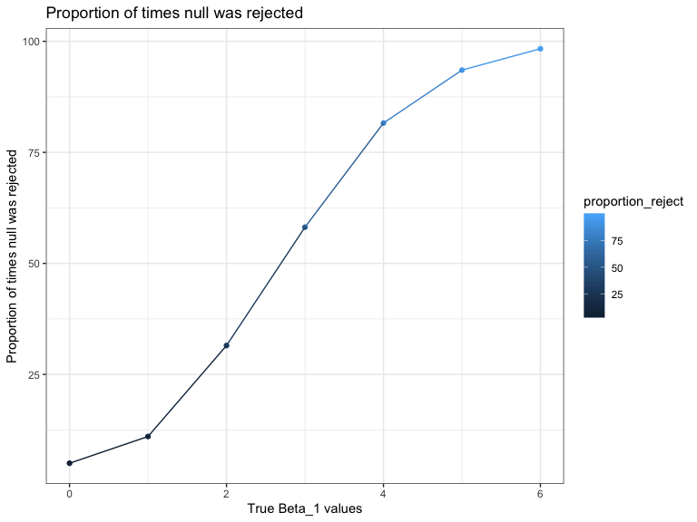
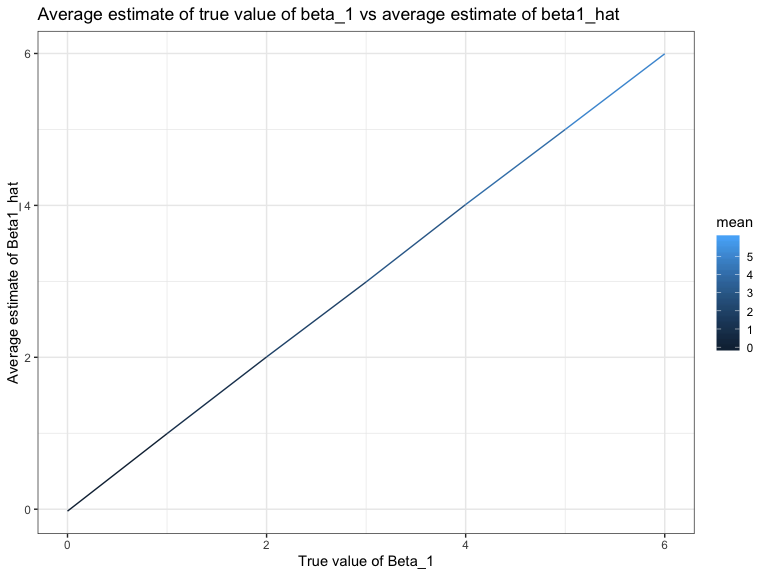

p8105\_hw5\_ec3342
================
Ekta Chaudhary
04/11/2019

# Question 1

The code chunk below loads the iris dataset from the tidyverse package
and introduces some missing values in each column. The purpose of this
problem is to fill in those missing values.

``` r
library(tidyverse)

set.seed(10)

iris_with_missing = iris %>% 
  map_df(~replace(.x, sample(1:150, 20), NA)) %>%
  mutate(Species = as.character(Species))
```

``` r
rpl_miss = function(x) {
if (is.numeric(x))
  { 
  x = replace_na(x, mean(x, na.rm = TRUE)) #Using a function to replace the missing values of numeric variables with the mean of non-missing values
  }
else if (is.character(x)) {
x = replace_na(x,"virginica")} #Using a function to replace the missing values of character variables, with "virginica"
  }
iris_new = map(iris_with_missing, rpl_miss) %>% 
as_tibble() #Applying the function to the columns of iris_with_missing using a map statement.
```

# Question 2

\*Create a tidy dataframe containing data from all participants,
including the subject ID, arm, and observations over time:

\*Start with a dataframe containing all file names; the list.files
function will help

``` r
file_name = list.files("./data")

read_csv_files = 
  function(file_name) {
    study_data = read_csv(
      file = str_c("./data/", file_name)
      ) %>%
      mutate(
        file = file_name
      )
  }
```

*Iterate over file names and read in data for each subject using
purrr::map and saving the result as a new variable in the dataframe
*Tidy the result; manipulate file names to include control arm and
subject ID, make sure weekly observations are “tidy”, and do any other
tidying that’s necessary

``` r
study_data = map_df(
  file_name, read_csv_files
) %>%
pivot_longer(
  week_1:week_8, names_to = "week",
  values_to = "measurement"
  ) %>%
  separate(
    file, into = c("group","subject",sep = "-")
    ) %>%
  mutate(
    group = recode(group,"con" = "Control","exp" = "Experimental")
    ) %>%
  select(group,subject,week,measurement)
```

    ## Parsed with column specification:
    ## cols(
    ##   week_1 = col_double(),
    ##   week_2 = col_double(),
    ##   week_3 = col_double(),
    ##   week_4 = col_double(),
    ##   week_5 = col_double(),
    ##   week_6 = col_double(),
    ##   week_7 = col_double(),
    ##   week_8 = col_double()
    ## )
    ## Parsed with column specification:
    ## cols(
    ##   week_1 = col_double(),
    ##   week_2 = col_double(),
    ##   week_3 = col_double(),
    ##   week_4 = col_double(),
    ##   week_5 = col_double(),
    ##   week_6 = col_double(),
    ##   week_7 = col_double(),
    ##   week_8 = col_double()
    ## )
    ## Parsed with column specification:
    ## cols(
    ##   week_1 = col_double(),
    ##   week_2 = col_double(),
    ##   week_3 = col_double(),
    ##   week_4 = col_double(),
    ##   week_5 = col_double(),
    ##   week_6 = col_double(),
    ##   week_7 = col_double(),
    ##   week_8 = col_double()
    ## )
    ## Parsed with column specification:
    ## cols(
    ##   week_1 = col_double(),
    ##   week_2 = col_double(),
    ##   week_3 = col_double(),
    ##   week_4 = col_double(),
    ##   week_5 = col_double(),
    ##   week_6 = col_double(),
    ##   week_7 = col_double(),
    ##   week_8 = col_double()
    ## )
    ## Parsed with column specification:
    ## cols(
    ##   week_1 = col_double(),
    ##   week_2 = col_double(),
    ##   week_3 = col_double(),
    ##   week_4 = col_double(),
    ##   week_5 = col_double(),
    ##   week_6 = col_double(),
    ##   week_7 = col_double(),
    ##   week_8 = col_double()
    ## )
    ## Parsed with column specification:
    ## cols(
    ##   week_1 = col_double(),
    ##   week_2 = col_double(),
    ##   week_3 = col_double(),
    ##   week_4 = col_double(),
    ##   week_5 = col_double(),
    ##   week_6 = col_double(),
    ##   week_7 = col_double(),
    ##   week_8 = col_double()
    ## )
    ## Parsed with column specification:
    ## cols(
    ##   week_1 = col_double(),
    ##   week_2 = col_double(),
    ##   week_3 = col_double(),
    ##   week_4 = col_double(),
    ##   week_5 = col_double(),
    ##   week_6 = col_double(),
    ##   week_7 = col_double(),
    ##   week_8 = col_double()
    ## )
    ## Parsed with column specification:
    ## cols(
    ##   week_1 = col_double(),
    ##   week_2 = col_double(),
    ##   week_3 = col_double(),
    ##   week_4 = col_double(),
    ##   week_5 = col_double(),
    ##   week_6 = col_double(),
    ##   week_7 = col_double(),
    ##   week_8 = col_double()
    ## )
    ## Parsed with column specification:
    ## cols(
    ##   week_1 = col_double(),
    ##   week_2 = col_double(),
    ##   week_3 = col_double(),
    ##   week_4 = col_double(),
    ##   week_5 = col_double(),
    ##   week_6 = col_double(),
    ##   week_7 = col_double(),
    ##   week_8 = col_double()
    ## )
    ## Parsed with column specification:
    ## cols(
    ##   week_1 = col_double(),
    ##   week_2 = col_double(),
    ##   week_3 = col_double(),
    ##   week_4 = col_double(),
    ##   week_5 = col_double(),
    ##   week_6 = col_double(),
    ##   week_7 = col_double(),
    ##   week_8 = col_double()
    ## )
    ## Parsed with column specification:
    ## cols(
    ##   week_1 = col_double(),
    ##   week_2 = col_double(),
    ##   week_3 = col_double(),
    ##   week_4 = col_double(),
    ##   week_5 = col_double(),
    ##   week_6 = col_double(),
    ##   week_7 = col_double(),
    ##   week_8 = col_double()
    ## )
    ## Parsed with column specification:
    ## cols(
    ##   week_1 = col_double(),
    ##   week_2 = col_double(),
    ##   week_3 = col_double(),
    ##   week_4 = col_double(),
    ##   week_5 = col_double(),
    ##   week_6 = col_double(),
    ##   week_7 = col_double(),
    ##   week_8 = col_double()
    ## )
    ## Parsed with column specification:
    ## cols(
    ##   week_1 = col_double(),
    ##   week_2 = col_double(),
    ##   week_3 = col_double(),
    ##   week_4 = col_double(),
    ##   week_5 = col_double(),
    ##   week_6 = col_double(),
    ##   week_7 = col_double(),
    ##   week_8 = col_double()
    ## )
    ## Parsed with column specification:
    ## cols(
    ##   week_1 = col_double(),
    ##   week_2 = col_double(),
    ##   week_3 = col_double(),
    ##   week_4 = col_double(),
    ##   week_5 = col_double(),
    ##   week_6 = col_double(),
    ##   week_7 = col_double(),
    ##   week_8 = col_double()
    ## )
    ## Parsed with column specification:
    ## cols(
    ##   week_1 = col_double(),
    ##   week_2 = col_double(),
    ##   week_3 = col_double(),
    ##   week_4 = col_double(),
    ##   week_5 = col_double(),
    ##   week_6 = col_double(),
    ##   week_7 = col_double(),
    ##   week_8 = col_double()
    ## )
    ## Parsed with column specification:
    ## cols(
    ##   week_1 = col_double(),
    ##   week_2 = col_double(),
    ##   week_3 = col_double(),
    ##   week_4 = col_double(),
    ##   week_5 = col_double(),
    ##   week_6 = col_double(),
    ##   week_7 = col_double(),
    ##   week_8 = col_double()
    ## )
    ## Parsed with column specification:
    ## cols(
    ##   week_1 = col_double(),
    ##   week_2 = col_double(),
    ##   week_3 = col_double(),
    ##   week_4 = col_double(),
    ##   week_5 = col_double(),
    ##   week_6 = col_double(),
    ##   week_7 = col_double(),
    ##   week_8 = col_double()
    ## )
    ## Parsed with column specification:
    ## cols(
    ##   week_1 = col_double(),
    ##   week_2 = col_double(),
    ##   week_3 = col_double(),
    ##   week_4 = col_double(),
    ##   week_5 = col_double(),
    ##   week_6 = col_double(),
    ##   week_7 = col_double(),
    ##   week_8 = col_double()
    ## )
    ## Parsed with column specification:
    ## cols(
    ##   week_1 = col_double(),
    ##   week_2 = col_double(),
    ##   week_3 = col_double(),
    ##   week_4 = col_double(),
    ##   week_5 = col_double(),
    ##   week_6 = col_double(),
    ##   week_7 = col_double(),
    ##   week_8 = col_double()
    ## )
    ## Parsed with column specification:
    ## cols(
    ##   week_1 = col_double(),
    ##   week_2 = col_double(),
    ##   week_3 = col_double(),
    ##   week_4 = col_double(),
    ##   week_5 = col_double(),
    ##   week_6 = col_double(),
    ##   week_7 = col_double(),
    ##   week_8 = col_double()
    ## )

\*Make a spaghetti plot showing observations on each subject over time,
to find the difference between the two groups.

``` r
study_data %>%
  ggplot(aes(x = week, y = measurement, group = subject, color = subject)) + 
  geom_point() +
  geom_line() +
  facet_grid(~group) + 
  labs(
    title = "Observation of Subjects over time",
    x = "Week",
    y = "Observation"
  ) + 
  theme(
    legend.position = "bottom"
  ) + viridis::scale_color_viridis(
    name = "Subject ID",
    discrete = TRUE
  )
```


**Description of the plots:**

As we can see from the two plots above, in the experimental arm there is
an increase in the observation score with time. In the control arm,
however the observation score remains somewhat constant. This shows that
treatment might be effective as the experimental arm shows an increase
in the observation scores with time.

# Question 3

\#Conducting a simulation to explore power in a simple linear
regression.

\#Fixed the following design elements: n=30, beta0=2,beta1 = 0,σ2=50
i.e. sd= sqrt(50) and formed the linear model.

``` r
set.seed(1)

sim_regression = function(n = 30, beta0 = 2, beta1 = 0) {
  
  sim_data = tibble(
    x = rnorm(n, mean = 0, sd = 1),
    y = beta0 + beta1 * x + rnorm(n, 0, sqrt(50))
  )
  
  ls_fit = lm(y ~ x, data = sim_data)
  
  tibble(
    beta1_hat = as.numeric(broom::tidy(ls_fit)[2,2]),
    p_value = as.numeric(broom::tidy(ls_fit)[2,5]) 
  )
}
```

\#Generating 10000 datasets from the model.

``` r
sim_results = tibble(
  beta_1 = c(0,1,2,3,4,5,6) #Repeating for β1={1,2,3,4,5,6}
  ) %>%
  mutate(
    output_list = map(.x = beta_1, ~rerun(10000, sim_regression(beta1 = .x))), #Generating 10000 datasets
  output_df = map(output_list, bind_rows) #bind_rows used to join the results across each individual runs of the simulation
  ) %>% 
  unnest(output_df) %>%
  select(beta_1,beta1_hat,p_value) 
```

\#Making a plot showing the proportion of times the null was rejected
(the power of the test) on the y axis and the true value of β1 on the x
axis.

``` r
sim_results %>%
  group_by(beta_1) %>%
  count(reject_null = p_value < 0.05) %>%
  mutate(
    proportion_reject = n/10000 * 100
  ) %>%
  filter(reject_null == "TRUE") %>%
  ggplot(aes(x = beta_1, y = proportion_reject, color = proportion_reject)) + geom_point() + geom_line() + labs(
    title = "Proportion of times null was rejected",
    x = "True Beta_1 values",
    y = "Proportion of times null was rejected/ Power"
  ) + scale_x_continuous(
    breaks = c(0,1,2,3,4,5,6),
    labels = c(0,1,2,3,4,5,6)
  )
```



``` r
  theme_bw()
```

    ## List of 65
    ##  $ line                      :List of 6
    ##   ..$ colour       : chr "black"
    ##   ..$ size         : num 0.5
    ##   ..$ linetype     : num 1
    ##   ..$ lineend      : chr "butt"
    ##   ..$ arrow        : logi FALSE
    ##   ..$ inherit.blank: logi TRUE
    ##   ..- attr(*, "class")= chr [1:2] "element_line" "element"
    ##  $ rect                      :List of 5
    ##   ..$ fill         : chr "white"
    ##   ..$ colour       : chr "black"
    ##   ..$ size         : num 0.5
    ##   ..$ linetype     : num 1
    ##   ..$ inherit.blank: logi TRUE
    ##   ..- attr(*, "class")= chr [1:2] "element_rect" "element"
    ##  $ text                      :List of 11
    ##   ..$ family       : chr ""
    ##   ..$ face         : chr "plain"
    ##   ..$ colour       : chr "black"
    ##   ..$ size         : num 11
    ##   ..$ hjust        : num 0.5
    ##   ..$ vjust        : num 0.5
    ##   ..$ angle        : num 0
    ##   ..$ lineheight   : num 0.9
    ##   ..$ margin       : 'margin' num [1:4] 0pt 0pt 0pt 0pt
    ##   .. ..- attr(*, "valid.unit")= int 8
    ##   .. ..- attr(*, "unit")= chr "pt"
    ##   ..$ debug        : logi FALSE
    ##   ..$ inherit.blank: logi TRUE
    ##   ..- attr(*, "class")= chr [1:2] "element_text" "element"
    ##  $ axis.title.x              :List of 11
    ##   ..$ family       : NULL
    ##   ..$ face         : NULL
    ##   ..$ colour       : NULL
    ##   ..$ size         : NULL
    ##   ..$ hjust        : NULL
    ##   ..$ vjust        : num 1
    ##   ..$ angle        : NULL
    ##   ..$ lineheight   : NULL
    ##   ..$ margin       : 'margin' num [1:4] 2.75pt 0pt 0pt 0pt
    ##   .. ..- attr(*, "valid.unit")= int 8
    ##   .. ..- attr(*, "unit")= chr "pt"
    ##   ..$ debug        : NULL
    ##   ..$ inherit.blank: logi TRUE
    ##   ..- attr(*, "class")= chr [1:2] "element_text" "element"
    ##  $ axis.title.x.top          :List of 11
    ##   ..$ family       : NULL
    ##   ..$ face         : NULL
    ##   ..$ colour       : NULL
    ##   ..$ size         : NULL
    ##   ..$ hjust        : NULL
    ##   ..$ vjust        : num 0
    ##   ..$ angle        : NULL
    ##   ..$ lineheight   : NULL
    ##   ..$ margin       : 'margin' num [1:4] 0pt 0pt 2.75pt 0pt
    ##   .. ..- attr(*, "valid.unit")= int 8
    ##   .. ..- attr(*, "unit")= chr "pt"
    ##   ..$ debug        : NULL
    ##   ..$ inherit.blank: logi TRUE
    ##   ..- attr(*, "class")= chr [1:2] "element_text" "element"
    ##  $ axis.title.y              :List of 11
    ##   ..$ family       : NULL
    ##   ..$ face         : NULL
    ##   ..$ colour       : NULL
    ##   ..$ size         : NULL
    ##   ..$ hjust        : NULL
    ##   ..$ vjust        : num 1
    ##   ..$ angle        : num 90
    ##   ..$ lineheight   : NULL
    ##   ..$ margin       : 'margin' num [1:4] 0pt 2.75pt 0pt 0pt
    ##   .. ..- attr(*, "valid.unit")= int 8
    ##   .. ..- attr(*, "unit")= chr "pt"
    ##   ..$ debug        : NULL
    ##   ..$ inherit.blank: logi TRUE
    ##   ..- attr(*, "class")= chr [1:2] "element_text" "element"
    ##  $ axis.title.y.right        :List of 11
    ##   ..$ family       : NULL
    ##   ..$ face         : NULL
    ##   ..$ colour       : NULL
    ##   ..$ size         : NULL
    ##   ..$ hjust        : NULL
    ##   ..$ vjust        : num 0
    ##   ..$ angle        : num -90
    ##   ..$ lineheight   : NULL
    ##   ..$ margin       : 'margin' num [1:4] 0pt 0pt 0pt 2.75pt
    ##   .. ..- attr(*, "valid.unit")= int 8
    ##   .. ..- attr(*, "unit")= chr "pt"
    ##   ..$ debug        : NULL
    ##   ..$ inherit.blank: logi TRUE
    ##   ..- attr(*, "class")= chr [1:2] "element_text" "element"
    ##  $ axis.text                 :List of 11
    ##   ..$ family       : NULL
    ##   ..$ face         : NULL
    ##   ..$ colour       : chr "grey30"
    ##   ..$ size         : 'rel' num 0.8
    ##   ..$ hjust        : NULL
    ##   ..$ vjust        : NULL
    ##   ..$ angle        : NULL
    ##   ..$ lineheight   : NULL
    ##   ..$ margin       : NULL
    ##   ..$ debug        : NULL
    ##   ..$ inherit.blank: logi TRUE
    ##   ..- attr(*, "class")= chr [1:2] "element_text" "element"
    ##  $ axis.text.x               :List of 11
    ##   ..$ family       : NULL
    ##   ..$ face         : NULL
    ##   ..$ colour       : NULL
    ##   ..$ size         : NULL
    ##   ..$ hjust        : NULL
    ##   ..$ vjust        : num 1
    ##   ..$ angle        : NULL
    ##   ..$ lineheight   : NULL
    ##   ..$ margin       : 'margin' num [1:4] 2.2pt 0pt 0pt 0pt
    ##   .. ..- attr(*, "valid.unit")= int 8
    ##   .. ..- attr(*, "unit")= chr "pt"
    ##   ..$ debug        : NULL
    ##   ..$ inherit.blank: logi TRUE
    ##   ..- attr(*, "class")= chr [1:2] "element_text" "element"
    ##  $ axis.text.x.top           :List of 11
    ##   ..$ family       : NULL
    ##   ..$ face         : NULL
    ##   ..$ colour       : NULL
    ##   ..$ size         : NULL
    ##   ..$ hjust        : NULL
    ##   ..$ vjust        : num 0
    ##   ..$ angle        : NULL
    ##   ..$ lineheight   : NULL
    ##   ..$ margin       : 'margin' num [1:4] 0pt 0pt 2.2pt 0pt
    ##   .. ..- attr(*, "valid.unit")= int 8
    ##   .. ..- attr(*, "unit")= chr "pt"
    ##   ..$ debug        : NULL
    ##   ..$ inherit.blank: logi TRUE
    ##   ..- attr(*, "class")= chr [1:2] "element_text" "element"
    ##  $ axis.text.y               :List of 11
    ##   ..$ family       : NULL
    ##   ..$ face         : NULL
    ##   ..$ colour       : NULL
    ##   ..$ size         : NULL
    ##   ..$ hjust        : num 1
    ##   ..$ vjust        : NULL
    ##   ..$ angle        : NULL
    ##   ..$ lineheight   : NULL
    ##   ..$ margin       : 'margin' num [1:4] 0pt 2.2pt 0pt 0pt
    ##   .. ..- attr(*, "valid.unit")= int 8
    ##   .. ..- attr(*, "unit")= chr "pt"
    ##   ..$ debug        : NULL
    ##   ..$ inherit.blank: logi TRUE
    ##   ..- attr(*, "class")= chr [1:2] "element_text" "element"
    ##  $ axis.text.y.right         :List of 11
    ##   ..$ family       : NULL
    ##   ..$ face         : NULL
    ##   ..$ colour       : NULL
    ##   ..$ size         : NULL
    ##   ..$ hjust        : num 0
    ##   ..$ vjust        : NULL
    ##   ..$ angle        : NULL
    ##   ..$ lineheight   : NULL
    ##   ..$ margin       : 'margin' num [1:4] 0pt 0pt 0pt 2.2pt
    ##   .. ..- attr(*, "valid.unit")= int 8
    ##   .. ..- attr(*, "unit")= chr "pt"
    ##   ..$ debug        : NULL
    ##   ..$ inherit.blank: logi TRUE
    ##   ..- attr(*, "class")= chr [1:2] "element_text" "element"
    ##  $ axis.ticks                :List of 6
    ##   ..$ colour       : chr "grey20"
    ##   ..$ size         : NULL
    ##   ..$ linetype     : NULL
    ##   ..$ lineend      : NULL
    ##   ..$ arrow        : logi FALSE
    ##   ..$ inherit.blank: logi TRUE
    ##   ..- attr(*, "class")= chr [1:2] "element_line" "element"
    ##  $ axis.ticks.length         : 'unit' num 2.75pt
    ##   ..- attr(*, "valid.unit")= int 8
    ##   ..- attr(*, "unit")= chr "pt"
    ##  $ axis.ticks.length.x       : NULL
    ##  $ axis.ticks.length.x.top   : NULL
    ##  $ axis.ticks.length.x.bottom: NULL
    ##  $ axis.ticks.length.y       : NULL
    ##  $ axis.ticks.length.y.left  : NULL
    ##  $ axis.ticks.length.y.right : NULL
    ##  $ axis.line                 : list()
    ##   ..- attr(*, "class")= chr [1:2] "element_blank" "element"
    ##  $ axis.line.x               : NULL
    ##  $ axis.line.y               : NULL
    ##  $ legend.background         :List of 5
    ##   ..$ fill         : NULL
    ##   ..$ colour       : logi NA
    ##   ..$ size         : NULL
    ##   ..$ linetype     : NULL
    ##   ..$ inherit.blank: logi TRUE
    ##   ..- attr(*, "class")= chr [1:2] "element_rect" "element"
    ##  $ legend.margin             : 'margin' num [1:4] 5.5pt 5.5pt 5.5pt 5.5pt
    ##   ..- attr(*, "valid.unit")= int 8
    ##   ..- attr(*, "unit")= chr "pt"
    ##  $ legend.spacing            : 'unit' num 11pt
    ##   ..- attr(*, "valid.unit")= int 8
    ##   ..- attr(*, "unit")= chr "pt"
    ##  $ legend.spacing.x          : NULL
    ##  $ legend.spacing.y          : NULL
    ##  $ legend.key                :List of 5
    ##   ..$ fill         : chr "white"
    ##   ..$ colour       : logi NA
    ##   ..$ size         : NULL
    ##   ..$ linetype     : NULL
    ##   ..$ inherit.blank: logi TRUE
    ##   ..- attr(*, "class")= chr [1:2] "element_rect" "element"
    ##  $ legend.key.size           : 'unit' num 1.2lines
    ##   ..- attr(*, "valid.unit")= int 3
    ##   ..- attr(*, "unit")= chr "lines"
    ##  $ legend.key.height         : NULL
    ##  $ legend.key.width          : NULL
    ##  $ legend.text               :List of 11
    ##   ..$ family       : NULL
    ##   ..$ face         : NULL
    ##   ..$ colour       : NULL
    ##   ..$ size         : 'rel' num 0.8
    ##   ..$ hjust        : NULL
    ##   ..$ vjust        : NULL
    ##   ..$ angle        : NULL
    ##   ..$ lineheight   : NULL
    ##   ..$ margin       : NULL
    ##   ..$ debug        : NULL
    ##   ..$ inherit.blank: logi TRUE
    ##   ..- attr(*, "class")= chr [1:2] "element_text" "element"
    ##  $ legend.text.align         : NULL
    ##  $ legend.title              :List of 11
    ##   ..$ family       : NULL
    ##   ..$ face         : NULL
    ##   ..$ colour       : NULL
    ##   ..$ size         : NULL
    ##   ..$ hjust        : num 0
    ##   ..$ vjust        : NULL
    ##   ..$ angle        : NULL
    ##   ..$ lineheight   : NULL
    ##   ..$ margin       : NULL
    ##   ..$ debug        : NULL
    ##   ..$ inherit.blank: logi TRUE
    ##   ..- attr(*, "class")= chr [1:2] "element_text" "element"
    ##  $ legend.title.align        : NULL
    ##  $ legend.position           : chr "right"
    ##  $ legend.direction          : NULL
    ##  $ legend.justification      : chr "center"
    ##  $ legend.box                : NULL
    ##  $ legend.box.margin         : 'margin' num [1:4] 0cm 0cm 0cm 0cm
    ##   ..- attr(*, "valid.unit")= int 1
    ##   ..- attr(*, "unit")= chr "cm"
    ##  $ legend.box.background     : list()
    ##   ..- attr(*, "class")= chr [1:2] "element_blank" "element"
    ##  $ legend.box.spacing        : 'unit' num 11pt
    ##   ..- attr(*, "valid.unit")= int 8
    ##   ..- attr(*, "unit")= chr "pt"
    ##  $ panel.background          :List of 5
    ##   ..$ fill         : chr "white"
    ##   ..$ colour       : logi NA
    ##   ..$ size         : NULL
    ##   ..$ linetype     : NULL
    ##   ..$ inherit.blank: logi TRUE
    ##   ..- attr(*, "class")= chr [1:2] "element_rect" "element"
    ##  $ panel.border              :List of 5
    ##   ..$ fill         : logi NA
    ##   ..$ colour       : chr "grey20"
    ##   ..$ size         : NULL
    ##   ..$ linetype     : NULL
    ##   ..$ inherit.blank: logi TRUE
    ##   ..- attr(*, "class")= chr [1:2] "element_rect" "element"
    ##  $ panel.spacing             : 'unit' num 5.5pt
    ##   ..- attr(*, "valid.unit")= int 8
    ##   ..- attr(*, "unit")= chr "pt"
    ##  $ panel.spacing.x           : NULL
    ##  $ panel.spacing.y           : NULL
    ##  $ panel.grid                :List of 6
    ##   ..$ colour       : chr "grey92"
    ##   ..$ size         : NULL
    ##   ..$ linetype     : NULL
    ##   ..$ lineend      : NULL
    ##   ..$ arrow        : logi FALSE
    ##   ..$ inherit.blank: logi TRUE
    ##   ..- attr(*, "class")= chr [1:2] "element_line" "element"
    ##  $ panel.grid.minor          :List of 6
    ##   ..$ colour       : NULL
    ##   ..$ size         : 'rel' num 0.5
    ##   ..$ linetype     : NULL
    ##   ..$ lineend      : NULL
    ##   ..$ arrow        : logi FALSE
    ##   ..$ inherit.blank: logi TRUE
    ##   ..- attr(*, "class")= chr [1:2] "element_line" "element"
    ##  $ panel.ontop               : logi FALSE
    ##  $ plot.background           :List of 5
    ##   ..$ fill         : NULL
    ##   ..$ colour       : chr "white"
    ##   ..$ size         : NULL
    ##   ..$ linetype     : NULL
    ##   ..$ inherit.blank: logi TRUE
    ##   ..- attr(*, "class")= chr [1:2] "element_rect" "element"
    ##  $ plot.title                :List of 11
    ##   ..$ family       : NULL
    ##   ..$ face         : NULL
    ##   ..$ colour       : NULL
    ##   ..$ size         : 'rel' num 1.2
    ##   ..$ hjust        : num 0
    ##   ..$ vjust        : num 1
    ##   ..$ angle        : NULL
    ##   ..$ lineheight   : NULL
    ##   ..$ margin       : 'margin' num [1:4] 0pt 0pt 5.5pt 0pt
    ##   .. ..- attr(*, "valid.unit")= int 8
    ##   .. ..- attr(*, "unit")= chr "pt"
    ##   ..$ debug        : NULL
    ##   ..$ inherit.blank: logi TRUE
    ##   ..- attr(*, "class")= chr [1:2] "element_text" "element"
    ##  $ plot.subtitle             :List of 11
    ##   ..$ family       : NULL
    ##   ..$ face         : NULL
    ##   ..$ colour       : NULL
    ##   ..$ size         : NULL
    ##   ..$ hjust        : num 0
    ##   ..$ vjust        : num 1
    ##   ..$ angle        : NULL
    ##   ..$ lineheight   : NULL
    ##   ..$ margin       : 'margin' num [1:4] 0pt 0pt 5.5pt 0pt
    ##   .. ..- attr(*, "valid.unit")= int 8
    ##   .. ..- attr(*, "unit")= chr "pt"
    ##   ..$ debug        : NULL
    ##   ..$ inherit.blank: logi TRUE
    ##   ..- attr(*, "class")= chr [1:2] "element_text" "element"
    ##  $ plot.caption              :List of 11
    ##   ..$ family       : NULL
    ##   ..$ face         : NULL
    ##   ..$ colour       : NULL
    ##   ..$ size         : 'rel' num 0.8
    ##   ..$ hjust        : num 1
    ##   ..$ vjust        : num 1
    ##   ..$ angle        : NULL
    ##   ..$ lineheight   : NULL
    ##   ..$ margin       : 'margin' num [1:4] 5.5pt 0pt 0pt 0pt
    ##   .. ..- attr(*, "valid.unit")= int 8
    ##   .. ..- attr(*, "unit")= chr "pt"
    ##   ..$ debug        : NULL
    ##   ..$ inherit.blank: logi TRUE
    ##   ..- attr(*, "class")= chr [1:2] "element_text" "element"
    ##  $ plot.tag                  :List of 11
    ##   ..$ family       : NULL
    ##   ..$ face         : NULL
    ##   ..$ colour       : NULL
    ##   ..$ size         : 'rel' num 1.2
    ##   ..$ hjust        : num 0.5
    ##   ..$ vjust        : num 0.5
    ##   ..$ angle        : NULL
    ##   ..$ lineheight   : NULL
    ##   ..$ margin       : NULL
    ##   ..$ debug        : NULL
    ##   ..$ inherit.blank: logi TRUE
    ##   ..- attr(*, "class")= chr [1:2] "element_text" "element"
    ##  $ plot.tag.position         : chr "topleft"
    ##  $ plot.margin               : 'margin' num [1:4] 5.5pt 5.5pt 5.5pt 5.5pt
    ##   ..- attr(*, "valid.unit")= int 8
    ##   ..- attr(*, "unit")= chr "pt"
    ##  $ strip.background          :List of 5
    ##   ..$ fill         : chr "grey85"
    ##   ..$ colour       : chr "grey20"
    ##   ..$ size         : NULL
    ##   ..$ linetype     : NULL
    ##   ..$ inherit.blank: logi TRUE
    ##   ..- attr(*, "class")= chr [1:2] "element_rect" "element"
    ##  $ strip.placement           : chr "inside"
    ##  $ strip.text                :List of 11
    ##   ..$ family       : NULL
    ##   ..$ face         : NULL
    ##   ..$ colour       : chr "grey10"
    ##   ..$ size         : 'rel' num 0.8
    ##   ..$ hjust        : NULL
    ##   ..$ vjust        : NULL
    ##   ..$ angle        : NULL
    ##   ..$ lineheight   : NULL
    ##   ..$ margin       : 'margin' num [1:4] 4.4pt 4.4pt 4.4pt 4.4pt
    ##   .. ..- attr(*, "valid.unit")= int 8
    ##   .. ..- attr(*, "unit")= chr "pt"
    ##   ..$ debug        : NULL
    ##   ..$ inherit.blank: logi TRUE
    ##   ..- attr(*, "class")= chr [1:2] "element_text" "element"
    ##  $ strip.text.x              : NULL
    ##  $ strip.text.y              :List of 11
    ##   ..$ family       : NULL
    ##   ..$ face         : NULL
    ##   ..$ colour       : NULL
    ##   ..$ size         : NULL
    ##   ..$ hjust        : NULL
    ##   ..$ vjust        : NULL
    ##   ..$ angle        : num -90
    ##   ..$ lineheight   : NULL
    ##   ..$ margin       : NULL
    ##   ..$ debug        : NULL
    ##   ..$ inherit.blank: logi TRUE
    ##   ..- attr(*, "class")= chr [1:2] "element_text" "element"
    ##  $ strip.switch.pad.grid     : 'unit' num 2.75pt
    ##   ..- attr(*, "valid.unit")= int 8
    ##   ..- attr(*, "unit")= chr "pt"
    ##  $ strip.switch.pad.wrap     : 'unit' num 2.75pt
    ##   ..- attr(*, "valid.unit")= int 8
    ##   ..- attr(*, "unit")= chr "pt"
    ##  - attr(*, "class")= chr [1:2] "theme" "gg"
    ##  - attr(*, "complete")= logi TRUE
    ##  - attr(*, "validate")= logi TRUE

\#Describe the association between effect size and power.

\#Make a plot showing the average estimate of Beta\_1 on the y axis and
the true value of Beta\_1 on the x axis. Make a second plot (or overlay
on the first) the average estimate of Beta\_1 only in samples for which
the null was rejected on the y axis and the true value of Beta\_1 on the
x axis. Is the sample average of Beta1\_hat across tests for which the
null is rejected approximately equal to the true value of Beta\_1? Why
or why not?

``` r
sim_results %>%
  group_by(beta_1) %>%
  summarise(
    mean = mean(beta1_hat)
  ) %>%
  ggplot(aes(x = beta_1, y = mean)) + geom_line() + labs(
    title = "average estimate of beta1_hat vs true value of beta_1",
    x = "Beta_1",
    y = "Mean"
  ) + 
  theme_bw()
```



``` r
sim_results %>%
  group_by(beta_1) %>%
  filter(p_value < 0.05) %>%
  summarise(
    mean = mean(beta1_hat)
  ) %>%
  ggplot(aes(x = beta_1, y = mean)) + geom_line() + labs(
    title = "average estimate of beta1_hat vs true value of beta_1",
    x = "Beta_1",
    y = "Mean"
  ) + 
  theme_bw()
```


